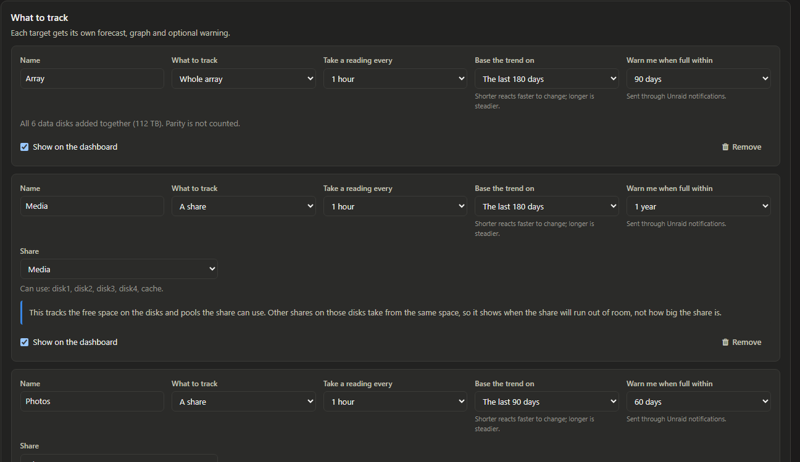
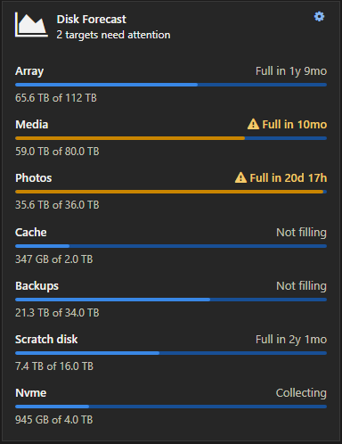

# Disk Forecast for Unraid

See when your array, disks, pools or shares will run out of space, so you can budget for new
drives before you need them.


## What you get

- **Tools › Disk Forecast.** Every target with how full it is, when it's expected to be full,
  a likely range and its expected growth. Pick one to see a graph of its usage and forecast
  (30 days to all history) and a projected-usage table.
- **What if I add a drive?** Pick a drive size (or type one) and see how much longer the
  selected target would last. The new capacity is drawn on the graph.
- **Settings › Disk Forecast.** Choose what to track: the whole array, any mix of disks and
  pools, or a share. Each gets its own reading interval (15 minutes to 1 day), how much
  history the trend uses (7 days to all of it), an optional warning, and whether it shows
  on the dashboard.
- **A dashboard tile** with each chosen target's time to full. Hide every target from the
  dashboard and the tile isn't shown at all.
- **Warnings** through Unraid's notifications when something is due to fill within the
  window you choose.
- **Dates and numbers follow your Unraid settings**: the date format under Settings › Date
  and Time, and the number format under Settings › Display.

<p>
  
  
</p>

## Install

In Unraid, go to **Plugins › Install Plugin** and paste:

```
https://github.com/Brad-Clarke/UnraidDiskForecast/releases/latest/download/diskforecast.plg
```

Requires Unraid 7.0 or later. Out of the box it tracks the whole array and each pool
separately, taking a reading every hour, basing the trend on the last 180 days, and warning
you 90 days before one fills. Change that, or add disks and shares, under
**Settings › Disk Forecast**. Updates arrive through Unraid's plugin manager and
keep your settings and readings. Removing the plugin deletes both.

## How the forecast works

- **Readings.** At each interval the plugin notes how much space each target has used. The
  first forecast appears after 7 days of readings; until then the row counts down to it.
- **The trend.** It fits a trend through the history you chose (180 days by default). The
  fit leans on the typical day, so a one-off big copy or clean-out doesn't swing it.
- **Checking itself.** Once there's enough history (the trend window plus about 11 weeks), the
  plugin replays its own past: at many earlier points it forecasts as if that were today,
  and compares with what actually happened. If your usage has tended to speed up or slow
  down, the estimate is adjusted for that.
- **The likely range** is how far those past forecasts were off: the full date usually
  lands inside it, but it isn't a promise. A sudden import or a change in habits can't be
  seen coming. Until the plugin can check itself, the row says *Rough estimate* with how far
  along it is; hover over it for the date it firms up.
- **Expected growth** is the free space divided by the time to full, so the numbers on a row
  always agree.
- **Not filling** means usage is flat or shrinking over the trend window, so there's no
  date to show.
- **What if I add a drive** keeps the same expected growth and adds the new space.

The full reasoning, with accuracy figures, is in [docs/decisions.md](docs/decisions.md).

## What it reads and writes

**Reads**
- Unraid's list of disks, pools and share settings.
- The free-space figures each mounted filesystem already keeps.
- It never looks inside your folders, so it never wakes a sleeping disk.

**Writes**
- Its settings, `/boot/config/plugins/diskforecast/diskforecast.cfg`, only when you press
  Apply.
- Its readings, one small file per target in `/boot/config/plugins/diskforecast/history/`.
  New readings wait in memory and are saved to the flash drive once a day and when the array
  stops, so the USB stick gets one small write per target per day. An unclean shutdown loses
  at most a day of readings.
- A note of which warnings it has sent, only when one is sent or cleared.

It sends nothing over the network.

## Support

Questions, bugs and ideas: [GitHub issues](https://github.com/Brad-Clarke/UnraidDiskForecast/issues).

Building, testing and releasing: [CONTRIBUTING.md](CONTRIBUTING.md).

Licence: GPLv2 ([LICENSE](LICENSE)). Chart.js (MIT) is bundled.
