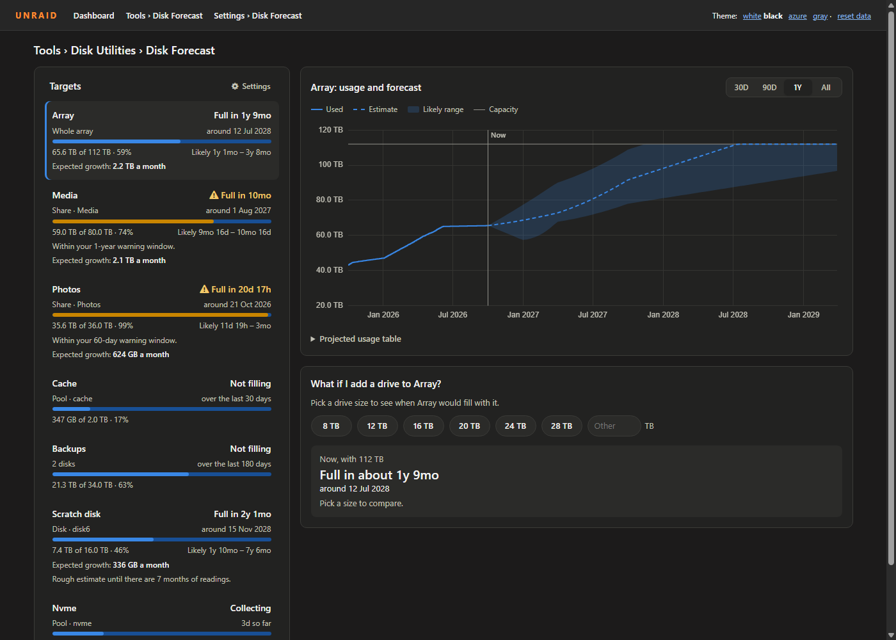

# Disk Forecast for Unraid

Tracks how fast your array, disks, pools or shares fill up and projects when each one will
run out of space, with an estimate, a likely range and the expected growth, so you can budget
for new drives before you need them.



- **Tools › Disk Forecast:** every target with its time to full, a graph of usage and
  forecast (30 days to all history), a projected-usage table, and a "What if I add a drive"
  card that shows the new full date and draws the new capacity on the graph.
- **Settings › Disk Forecast:** track the whole array, any mix of disks and pools, or a
  share, each with its own reading interval (15 minutes to 1 day), trend window (7 days to
  all history) and warning threshold.
- **Dashboard tile:** every target's time to full at a glance.
- **Warnings** through Unraid notifications when a target is due to fill within your window.

It only reads free-space figures the filesystem already keeps: no folder is scanned and no
disk is woken. Readings are kept in your pool's `appdata` folder, never on the flash drive.
How the forecast works and why it was chosen: [docs/decisions.md](docs/decisions.md).

## Install

In Unraid, go to **Plugins › Install Plugin** and paste:

```
https://github.com/Brad-Clarke/UnraidDiskForecast/releases/latest/download/diskforecast.plg
```

Requires Unraid 7.0 or later. Updates arrive through Unraid's plugin manager and keep your
settings and readings. Removing the plugin deletes both (start the array first, or the
readings folder can't be reached and is left behind).

**Support:** the Disk Forecast thread on the Unraid forums (link to follow).

## Development

Needs bash, GNU tar, xz, PHP 8.1+ and Python 3. `shellcheck` and `xmllint` for the checks.

```sh
scripts/build.sh --version 2026.09.30   # build/diskforecast-<version>-noarch-1.txz and build/diskforecast.plg
scripts/ci-checks.sh                    # XML, shellcheck, php -l, package audit, MD5
scripts/test-install-scripts.sh         # install/remove scripts are idempotent and offline
scripts/test-release-checks.sh          # the release gate refuses what it should
php -S 127.0.0.1:8765 dev/preview.php   # the real pages against a fake server
php dev/smoke.php                       # cron run, warnings, settings file and Unraid parsing
php -d memory_limit=1G dev/backtest.php # forecast accuracy against fake histories
```

Layout: `src/` is the package root and mirrors the Unraid filesystem; `plugin/` holds the
manifest template, `plugin.conf` (repository, support URL, minimum Unraid version) and the
Community Apps icon; `dev/` and `tests/` are never installed.

## Releasing

1. Add a `## <version>` section to `CHANGELOG.md` (version `YYYY.MM.DD`, or `YYYY.MM.DD.N`
   for a second release that day). Never reuse a version.
2. Tag and push: `git tag v<version> && git push origin v<version>`.
   The release workflow checks the tag, the changelog and the support URL, builds, runs every
   check, publishes the `.plg` and `.txz` to a GitHub release, and confirms the install URL
   serves the new version.
3. For a beta or a rehearsal, run the **Release** workflow by hand: tick *prerelease* for a
   beta (stable users are not offered it), or leave *dry run* ticked to check everything and
   publish nothing.

Licence: GPLv2 ([LICENSE](LICENSE)). Chart.js (MIT) is bundled in `assets/`.
